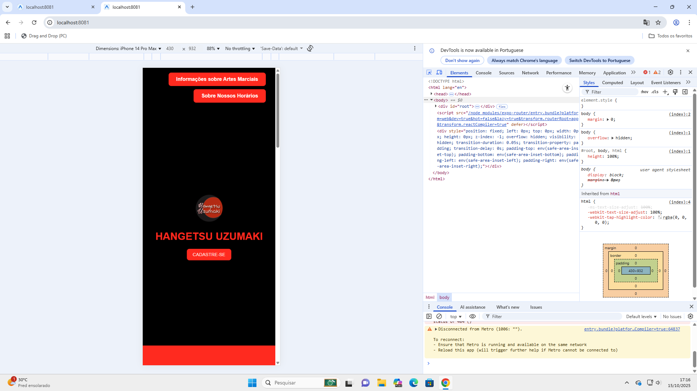
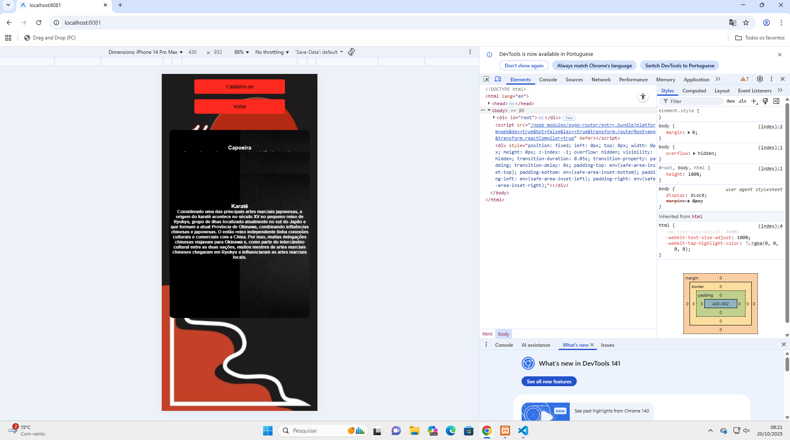
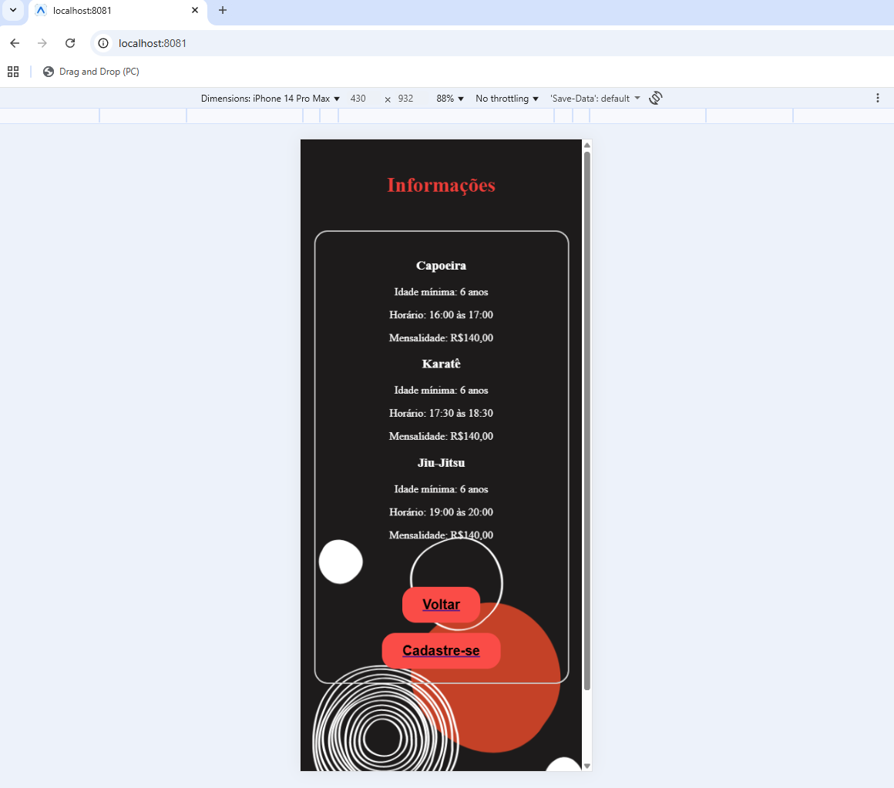
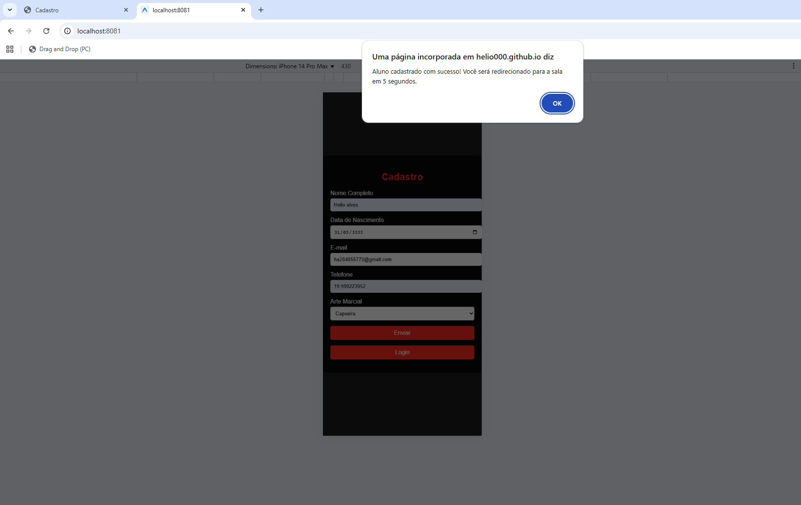
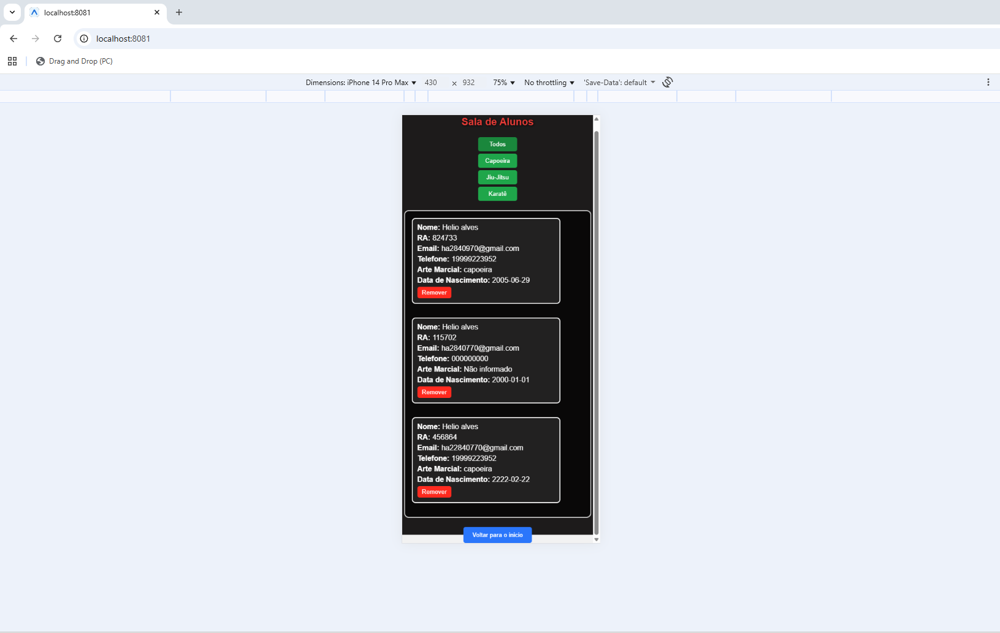
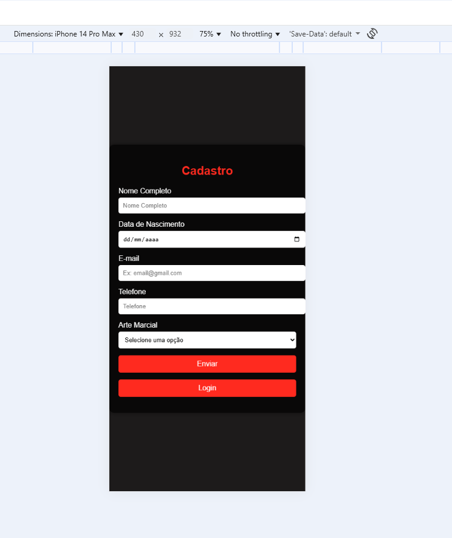

## Instalar dependências (Install dependencies)

1. Install dependencies

   ```bash
   npm install
   ```

2. Start the app (Inicie o aplicativo)

   ```bash
   npx expo start
   ```

   ## testes do moblie (mobile tests)

## TESTE (TEST) 01


##  TESTE (TEST) 02


## TESTE (TEST) 03


## TESTE (TEST) 04


## TESTE (TEST) 05


## TESTE (TEST) 06


