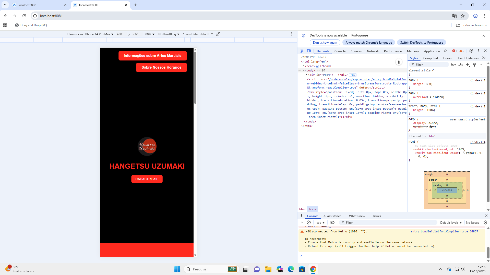
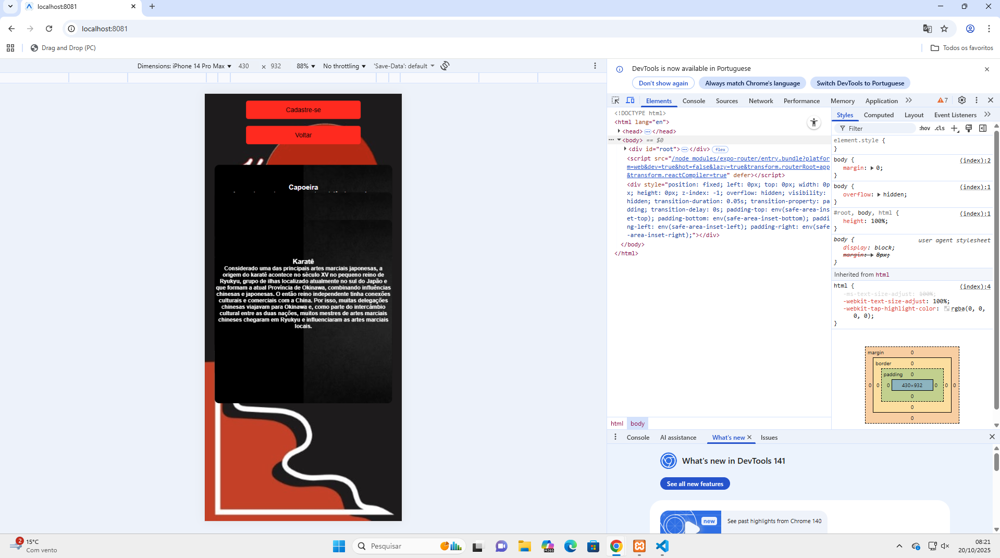
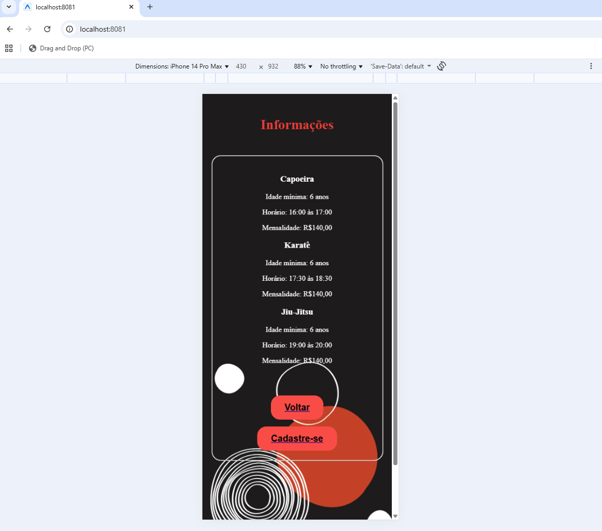
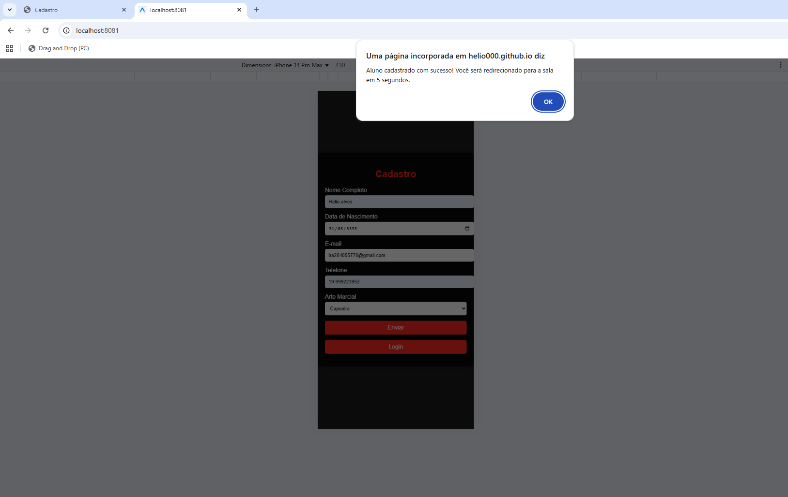
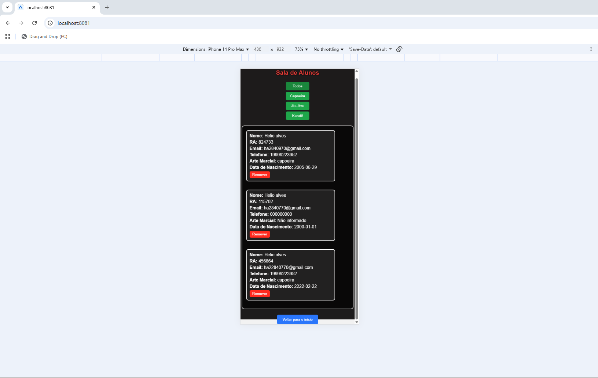
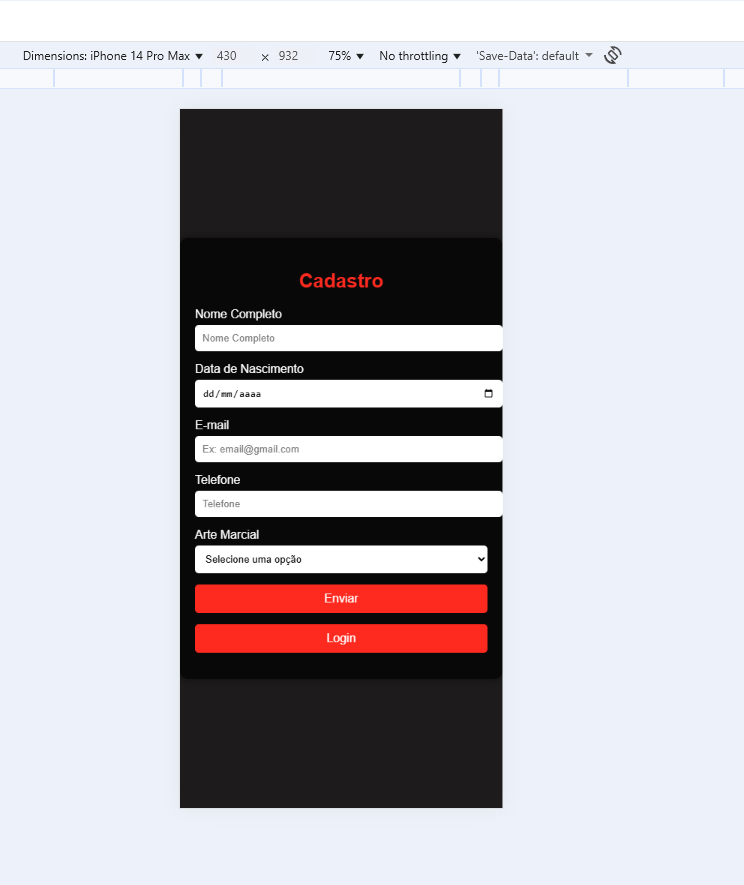
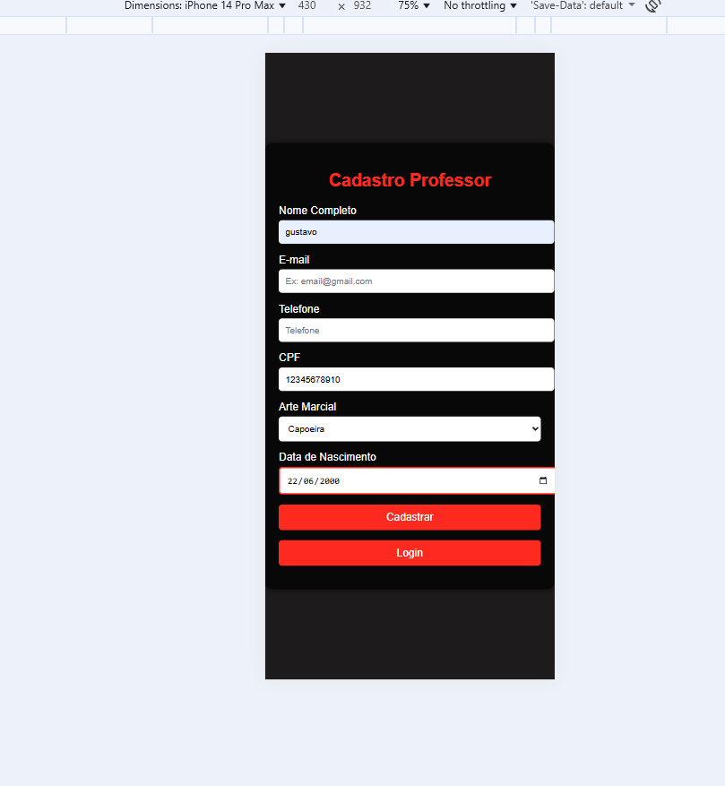
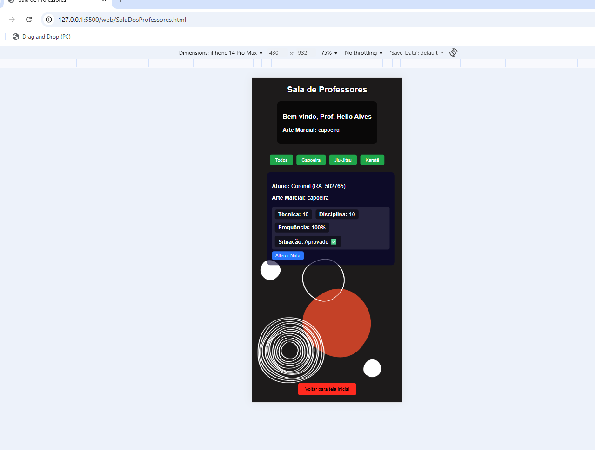

1. ## clona o meu repositorio
https://github.com/helio000/mobile-artes-marciais/tree/master

2. # abra o terminal e digita
cd mobile-artes-marciais

3. ## Instalar dependências (Install dependencies)


 Install dependencies

   ```bash
   npm install
   ```

 Launch the application on your own computer. (Inicie o aplicativo no seu proprio computador)

   ```bash
   npx expo start
   ```
   ## usar esse comando para ver no celular

 ```bash
   npx expo start --tunnel
   ```

. para acessar o seu app e ver no seu celular e so usar o codigo embaixo (To access your app and view it on your phone, just use the code below.)

## E so acessar o link que vai aparecer no https exemplo embaixo

https://as-kzxu-anonymous-8081.exp.direct/

 ## tem que criar um arquivo dentro da pasta app chamado index.js

 ```bash
import React from 'react';
import { Platform, SafeAreaView, StyleSheet, StatusBar } from 'react-native';
import { WebView } from 'react-native-webview';

export const API_URL = "https://back-projeto-2025.vercel.app"; // 👈 Aqui e o seu back no vercel


export default function Index() {
  const siteUrl = 'https://helio000.github.io/web-projeto2/'; aqui e o pages do seu web

  // Aqui você pode usar o API_URL se precisar fazer fetch ou axios futuramente
  console.log("Conectado ao backend:", API_URL);

  if (Platform.OS === 'web') {
    return (
      <SafeAreaView style={{ flex: 1 }}>
        <iframe
          src={siteUrl}
          style={{ width: '100%', height: '100%', border: 'none' }}
          title="App Web Preview"
        />
      </SafeAreaView>
    );
  }

  return (
    <SafeAreaView style={styles.container}>
      <WebView
        source={{ uri: siteUrl }}
        style={{ flex: 1 }}
        startInLoadingState={true}
      />
    </SafeAreaView>
  );
}

const styles = StyleSheet.create({
  container: {
    flex: 1,
    marginTop: Platform.OS === 'android' ? StatusBar.currentHeight : 0,
  },
});
 ```
 

 ## E muda de codigo da pasta chamada _layout.tsx q esta dentro da pasta app

```bash
import { DarkTheme, DefaultTheme, ThemeProvider } from '@react-navigation/native';
import { Stack } from 'expo-router';
import { StatusBar } from 'expo-status-bar';
import 'react-native-reanimated';

import { useColorScheme } from '@/hooks/use-color-scheme';

export default function RootLayout() {
  const colorScheme = useColorScheme();

  return (
    <ThemeProvider value={colorScheme === 'dark' ? DarkTheme : DefaultTheme}>
      <Stack
        screenOptions={{
          headerShown: false, // remove o header de todas as telas
        }}
      >
        {/* Sua tela principal (index.js) será carregada automaticamente */}
        <Stack.Screen
          name="modal"
          options={{
            presentation: 'modal',
            title: 'Modal',
          }}
        />
      </Stack>
      <StatusBar style="auto" />
    </ThemeProvider>
  );
}
```


   ## testes do moblie (mobile tests)

## TESTE (TEST) 01


##  TESTE (TEST) 02


## TESTE (TEST) 03


## TESTE (TEST) 04


## TESTE (TEST) 05


## TESTE (TEST) 06


## TESTE (TEST) 07


## TESTE (TEST) 08

